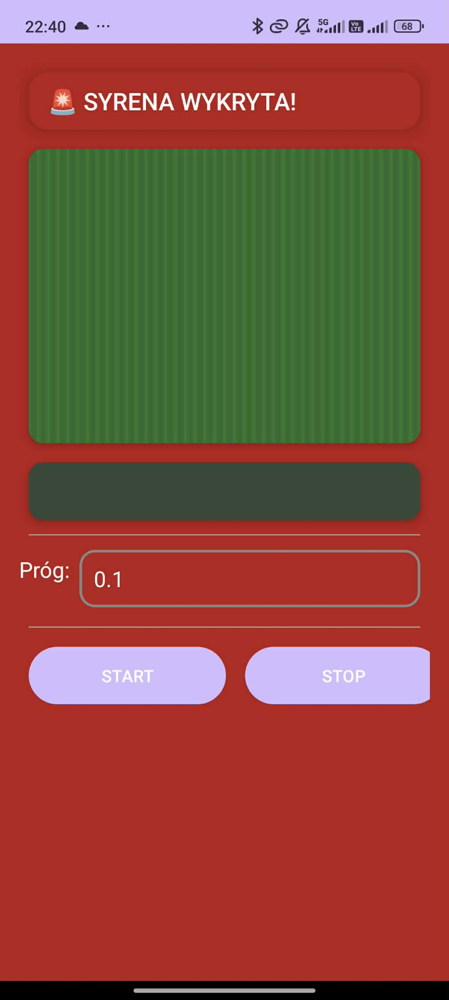
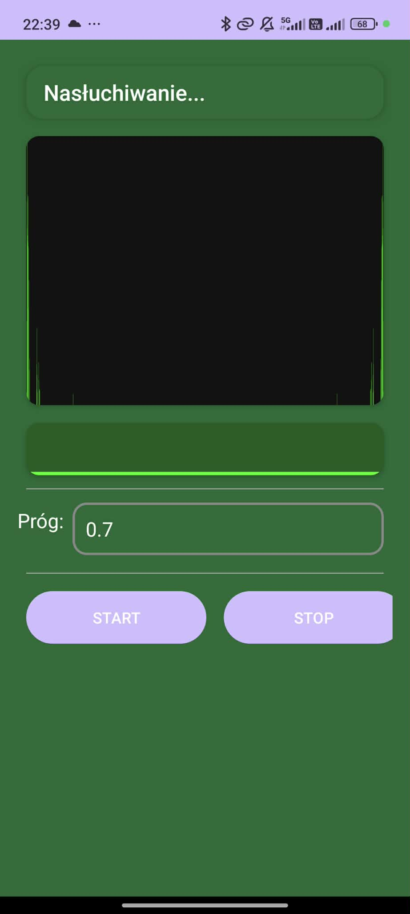

# AI Siren Detector 🚨

Aplikacja na Androida służąca do automatycznego wykrywania dźwięku syren alarmowych (policja, straż pożarna, karetki) w czasie rzeczywistym.

## 📝 Opis projektu

Aplikacja wykonana w ramach dodatkowego projektu na przedmiot Algorytmy Przetwarzania Sygnałów.

Projekt wykorzystuje mikrofon urządzenia do analizy otoczenia i powiadamiania użytkownika, gdy w pobliżu zostanie zidentyfikowany charakterystyczny sygnał dźwiękowy służb ratunkowych. 

**Główne zastosowania:**
* Wsparcie dla osób niesłyszących i niedosłyszących.
* Bezpieczeństwo kierowców (wyciszanie muzyki po wykryciu syreny - opcjonalnie).

## 📱 Wizualizacja (Screeny)

  
  

## 🛠️ Technologie
* **Język:** Kotlin
* **Platforma:** Android
* **Narzędzia:** Android Studio, Gradle

## 🚀 Funkcje
- [x] Nasłuchiwanie w tle.
- [x] Wizualne powiadomienia o wykryciu dźwięku.

## ⚠️ Uwaga
Aplikacja jest projektem edukacyjnym/prototypem. Nie należy polegać na niej jako na jedynym systemie bezpieczeństwa w sytuacjach zagrożenia życia.
